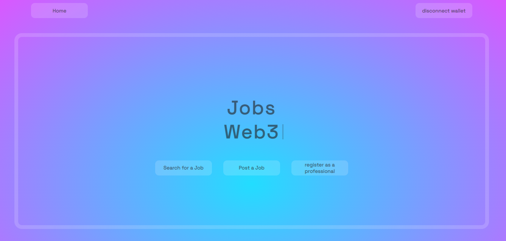
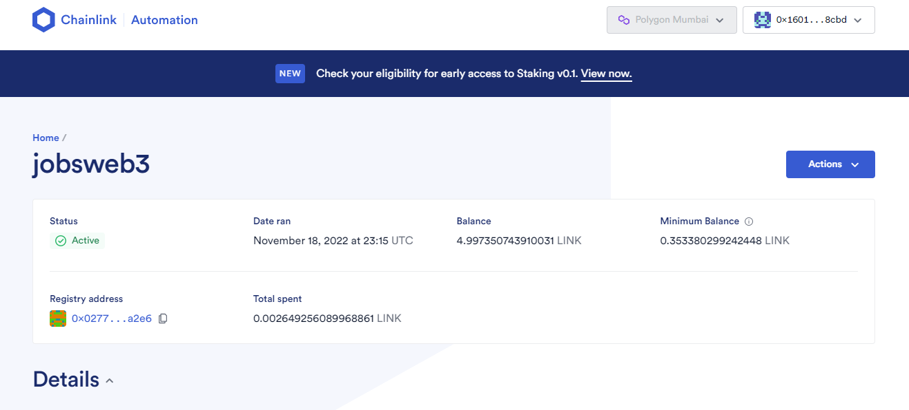

 

    
  

  
   

    
 # project for the Chainlink hackathon year 2022
    
  

  
  

     <a align="center" href="" target="_blank">
       <h1 align="center">JobsWeb3</h1>
    </a>
  

    a platform oriented to the business environment built on the web3.
  

   

  
  

    
  

  
  

    
  

  
   

     <a align="center" href="" target="_blank">
       <h1 align="center">you can post a job for free or post a premium job</h1>
    </a>
  

    premium jobs will rank higher but will be removed every week.
  

   

   
  

    
  

  
  

     <a align="center" href="" target="_blank">
       <h1 align="center">register as a professional to be able to apply for a job</h1>
    </a>
  

    This will help companies to see who is applying.
  

   

  
  

    
  

  
  

    
 # This is what a posted job looks like
    
  

  
   

    
  

  
  

    
 # This is what a job applicant looks like
    
  

  
   

    
  

  
    
 # the smart contract is automated so that the list of premium jobs is updated every week
    

  

    
  

  
  
    
 # I first set it to run every 2 minutes to make sure it's working properly.
    
 
  
  

    
  

  
  

  
 # technologies used
 
  

 
   

  
# to deploy the smart contract QuickNode was used
  
   

 
  

    
  

  
   

  
# using the hardhat framework
  
   

 
  

    
  

  
  

  
# it is currently on the polygon Testnet network
  
   

   
  

    
  

  
  
  
 
